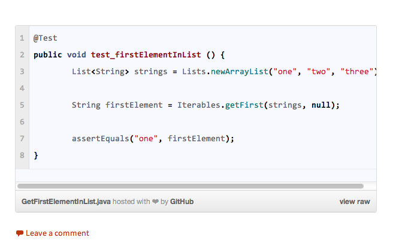

wordpress-gist-plugin
=====================

There is bunch of wordpress gist plugins that feel bloated with extras.  Github already provides a way to emebed gist into a web page but wordpress out of the box doesn't allow you to embed javascript.  The main code of the plugin was inspired from this [gist](https://gist.github.com/diije/5805069)

Installation
------------
1. Download zip
2. Upload wordpress-gist-plugin to the /wp-content/plugins/ directory or wordpress console.
3. Activate the plugin through the 'Plugins' menu in WordPress.

Usage
-----
Paste gist link into a post or a page 
* https://gist.github.com/justinmusgrove/6428883

If a gist has multiple files you can select one of using the url with the following format
* https://gist.github.com/justinmusgrove/6428883?file=embed-gist.php

Screenshots
-----------

